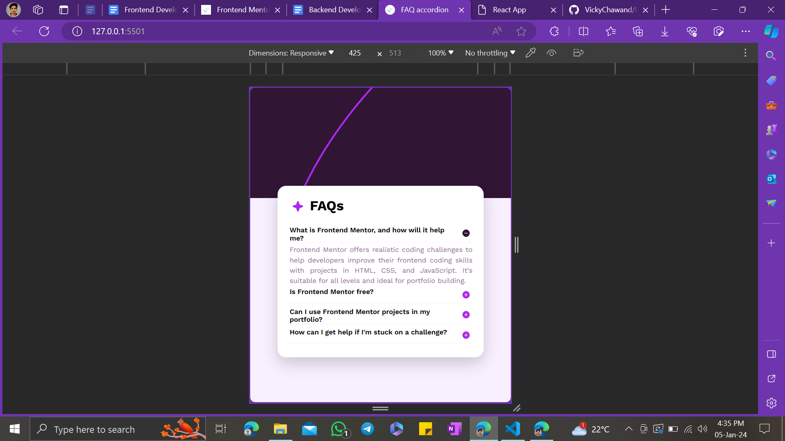

## Table of contents

- [Overview](#overview)
  - [The challenge](#the-challenge)
  - [Screenshot](#screenshot)
  - [Links](#links)
- [Built with](#built-with)
- [Author](#author)

### The challenge

Users should be able to:

- Hide/Show the answer to a question when the question is clicked
- Navigate the questions and hide/show answers using keyboard navigation alone
- View the optimal layout for the interface depending on their device's screen size
- See hover and focus states for all interactive elements on the page

### Screenshot

### Links
- Solution URL: [GitHub](https://github.com/VickyChawand/FAQ_accordian)
- Live Site URL: [FAQs](https://vickychawand.github.io/FAQ_accordian/)

### Built with

- Semantic HTML5 markup
- CSS custom properties
- Flexbox
- CSS Grid
- Mobile-first workflow
- Javascript

## Author

- Website - [Vicky Chawand](https://vicky-chawand-porfolio.netlify.app/)
- Frontend Mentor - [@VickyChawand](https://www.frontendmentor.io/profile/VickyChawand)
